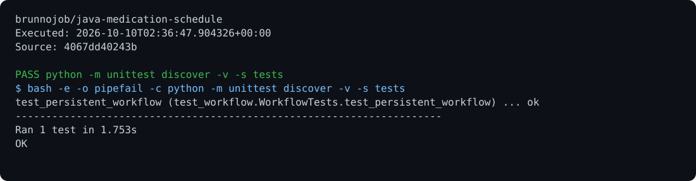

# Medication Schedule

A schedule of user-supplied times, with time zones, clock-change handling, and a record history.

## Run

Requirements: Java 17.

```sh
javac MedicationSchedule.java
java MedicationSchedule agenda.log init America/Sao_Paulo 08:00,20:00
java MedicationSchedule agenda.log report 2026-10-09 > result.json
```

## Behavior

`record instant taken|skipped` records an existing scheduled time. Future events and conflicting decisions are rejected. Nonexistent times during clock changes are omitted; duplicated times use the first occurrence. The program does not recommend doses or actions for missed times.

## Optional report archive

Use the [native C operations archive client](https://github.com/brunnojob/vercel-home-telemetry-api/tree/main/clients/c) to queue `result.json` under project `java-medication-schedule`. The client uses `BRUNNODEV_ACCESS_TOKEN` and retains unacknowledged reports locally.

## License

Original source and documentation are MIT licensed; see [LICENSE](LICENSE). Third-party dependencies and media retain their respective terms. Maintained by [Brunno Dev](https://brunnodev.store).

## Implementation update

Persisted dose records are validated against the configured schedule. A record cannot precede its scheduled instant or refer to a dose outside the configured times. The tool records user-supplied schedules and does not calculate prescriptions.

Contribution trailer: `Co-authored-by: nyctophile <33561761+ineedfoundmyway@users.noreply.github.com>`.

## Execution proof

[](https://github.com/brunnojob/java-medication-schedule/actions/workflows/proof.yml)



[Verified run](https://github.com/brunnojob/java-medication-schedule/actions/runs/38018086927) · [Execution report](docs/proof/evidence.json)

Run `python .proof/record.py` after installing the prerequisites above. The scenarios execute repository code and verify exit codes and expected output. CI publishes `execution-proof` with the transcript, input fingerprints and source commit. The downloadable report identifies the exact tested version; the workflow badge tracks the latest run.
